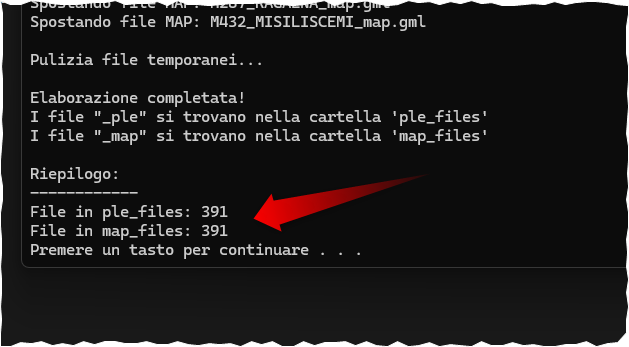
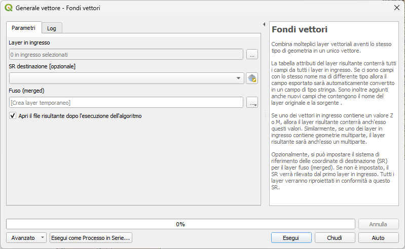

# catasto_unzip_all

Unzippa le cartelle e crea due cartelle separate per le map e ple, tutto da windows!!!

## Come usarlo

- scaricare il file *.bat
- copiarlo dentro la cartella che contiene tutte le sottocartelle da unzippare
- doppio clic sul file *.bat
- aspettare la conclusione dello script che vi informerà dei file unzippati

## script creato con l'ausilio di Claude AI

## QGIS

Usare l'algoritmo di Processing [Fondi](https://docs.qgis.org/3.34/it/docs/user_manual/processing_algs/qgis/vectorgeneral.html#qgismergevectorlayers) per fondere tutte le particelle o le mappe.

